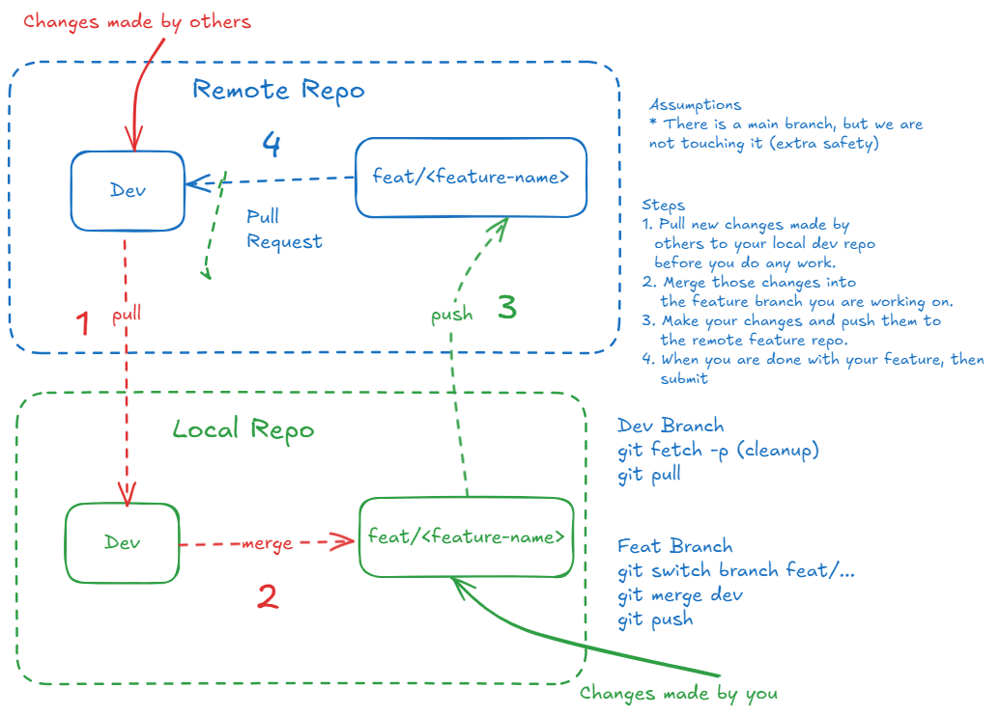

# ASSIGNMENT #4 (IN PROGRESS)

# IN PROGRESS
- **WARNING:**  This assignment is currently being developed.  You can see a preview here, but it is likely that the assignment will change.
- Start this assignment at your own risk.  
- This message will be removed when the assignment is final.  

## Objective
This week you will:  
- Work with branches and a basic Git Flow

## PREREQUISITES  
You have a working remote 

## ACTIVITY 1: 


### A Typical Git Flow



# WHAT TO TURN IN

- In the Slack channel #github-project, post the link to your GitHub repo that you created above when you are done.
- Your assignment will be completed in a markdown file. 
- Name the markdown file:

```
Assignment4<Lastname>
```

- Ensure in the root directory of your repository, you have a markdown file called "README.md."  In that file, include a link to the assignment this week. 
- Example: 

```
[Assignment #X](./Assignment#<Lastname>.md)
```

- Follow the directions above to ensure that your markdown file contains everything required for the assignment